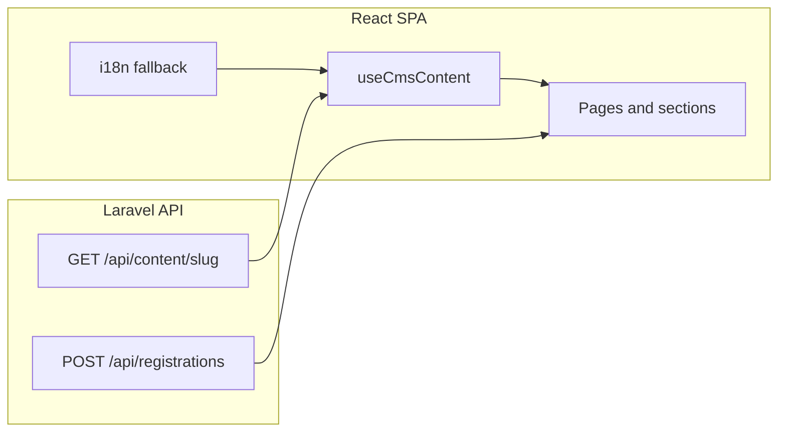

# Website redesign — Phase 1 audit (findings)

This document records the baseline audit of the KOON school website codebase (React frontend + Laravel API) before the luxury redesign rollout.

---

## 1. Frontend structure (React)

| Area | Detail |
|------|--------|
| **Entry** | [`src/main.tsx`](../src/main.tsx) — `MantineProvider` + `BrowserRouter` + global CSS |
| **Routing** | [`src/App.tsx`](../src/App.tsx) — Public: `/`, `/about`, `/academics`, `/student-life`, `/facilities`, `/admissions`, `/registration`, `/news`, `/contact`; Admin: `/admin/*` behind `RequireAdminAuth` |
| **Layout** | [`PageLayout`](../src/components/PageLayout.tsx) wraps `Header` → `main` → `Footer` |
| **i18n** | `react-i18next`; [`src/i18n/resources.ts`](../src/i18n/resources.ts) holds large `en`/`ar` trees; `document.documentElement.lang` + `dir` updated on language change |
| **Motion** | `framer-motion` on [`MotionSection`](../src/components/MotionSection.tsx) and mobile drawer in [`Header`](../src/components/Header.tsx) |
| **UI libs** | `@mantine/core` (theme in [`koonMantineTheme.ts`](../src/theme/koonMantineTheme.ts)); most public UI is **custom CSS** in [`index.css`](../src/index.css) (~2.6k lines) |
| **Icons** | `@tabler/icons-react` + local [`schoolIcons.tsx`](../src/components/icons/schoolIcons.tsx) |

### Homepage composition (pre-redesign reference)

The original [`HomePage.tsx`](../src/pages/HomePage.tsx) chain was:

1. `HeroSection` (CMS/i18n hero + image)
2. `StatsStrip`
3. `QuickLinksSection`
4. `VirtualTourSection`
5. `ValuesRibbonSection`
6. `ShowcaseSection`
7. `ProgramsSection` (CMS programs + i18n titles)
8. `FacilitiesTeaserSection`
9. `HighlightsSection` (“Why KOON?”)
10. `FacultySection`
11. `HomeNewsTeaserSection`
12. `TrustBadgesSection`
13. `FaqSection`
14. `CtaSection`

Inner pages ([`AboutPage`](../src/pages/AboutPage.tsx), Admissions, Contact, etc.) follow: `useCmsContent` + i18n fallbacks.

---

## 2. Data sources and API usage

| Source | Role |
|--------|------|
| **Laravel CMS** | `GET ${VITE_API_BASE_URL}/api/content/{slug}?locale=en|ar` via [`cmsClient.ts`](../src/services/cmsClient.ts). Slugs: `landing-page`, `about-page`, `admissions-page`, `contact-page`. If `VITE_API_BASE_URL` is empty or 404, fetcher returns `null`. |
| **Hook** | [`useCmsContent`](../src/hooks/useCmsContent.ts) merges CMS JSON with **i18n fallback**; loading and error states for UX. |
| **Types** | [`src/types/cms.ts`](../src/types/cms.ts) — `LandingPageContent`: `hero`, `programs[]`, `highlights[]`; parallel shapes for about/admissions/contact. |
| **Registration** | `POST /api/registrations`, `GET /api/registration-options` — see [`registrationOptionsClient.ts`](../src/services/registrationOptionsClient.ts), [`RegistrationPage`](../src/pages/RegistrationPage.tsx). |
| **Static imagery** | [`siteImagery.ts`](../src/content/siteImagery.ts), [`photoUrls.ts`](../src/content/photoUrls.ts) — mapped photos for programs, highlights, etc. |

---

## 3. Laravel (website-relevant)

| Piece | Detail |
|-------|--------|
| **Public content API** | [`ContentController::show`](../backend/app/Http/Controllers/Api/ContentController.php) — validates slug against [`ContentPage::allowedSlugs()`](../backend/app/Models/ContentPage.php), locale `en`/`ar`, returns **raw JSON payload** via [`ContentPagePayloadResource`](../backend/app/Http/Resources/ContentPagePayloadResource.php). |
| **Model** | `ContentPage`: `slug`, `locale`, `payload` (array), `published_at`; `published()` scope. |
| **Admin** | Sanctum-protected CRUD for content pages under `/api/admin/content-pages` ([`api.php`](../backend/routes/api.php)). |
| **Registration** | `RegistrationController`, options tables, submissions — important for conversion; orthogonal to marketing CMS payloads. |

**Implication:** Extending homepage structure via CMS requires extending `payload` + TS types + admin editor expectations, or keeping new blocks as i18n/static with clear “CMS later” boundaries.

---

## 4. Styling system

- **Primary system:** CSS variables in `:root` ([`index.css`](../src/index.css)) — KOON **navy (#164289) + sky (#48A9E0)**, light blue surfaces, Outfit / Plus Jakarta / Cairo (Google Fonts).
- **Mantine:** [`koonMantineTheme`](../src/theme/koonMantineTheme.ts) maps `koon` palette but **fontFamily is Segoe UI**, which **diverges** from marketing fonts in `body`.
- **Patterns:** Section surface classes (`section-surface--*`), cards, hero, CTA band (includes **infinite gradient animation** — note for restrained motion).
- **Gap vs brief:** Target palette is **deep green/teal + warm gold + ivory**; legacy site is **blue-forward**. Redesign introduced a scoped **homepage** token layer ([`home-premium.css`](../src/styles/home-premium.css)) rather than rewriting global tokens in one step.

---

## 5. Reusable components (inventory)

**Shell:** `Header`, `Footer`, `Logo`, `LanguageSwitcher`, `PageLayout`, `FigureImage`, `IconBadge`, `MotionSection`.

**Sections (homepage and shared):** `HeroSection`, `StatsStrip`, `QuickLinksSection`, `VirtualTourSection`, `ValuesRibbonSection`, `ShowcaseSection`, `ProgramsSection`, `FacilitiesTeaserSection`, `HighlightsSection`, `FacultySection`, `HomeNewsTeaserSection`, `TrustBadgesSection`, `FaqSection`, `CtaSection`, plus post-audit: `BilingualValueSection`, `AdmissionsFunnelSection`.

**Opportunity:** Shared abstractions for “section title + lead”, “primary/secondary CTA pair”, and “proof strip” can reduce repetition over time.

---

## 6. SEO and performance (baseline)

- **Meta:** Single [`index.html`](../index.html) — one `title` and `description`; per-route meta was a gap (addressed in implementation via `react-helmet-async`).
- **Semantics:** Sections use `<section>` in places; heading hierarchy should keep a single `h1` on the home view.
- **Images:** Many `` with `loading="lazy"`; hero uses `fetchPriority="high"`; `aspect-ratio` used in several layouts to limit CLS.
- **Bundle:** Framer Motion + Mantine — reasonable; avoid heavy UI kits unless justified.

---

## 7. Design / UX / conversion issues (identified)

**Content and hierarchy**

- **Repeated “why us” narrative:** `ValuesRibbonSection`, `ShowcaseSection`, and `HighlightsSection` all argued value — risk of duplication (homepage redesign removed the ribbon from the home flow).
- **Generic superlatives:** i18n highlights previously included weak claims — copy was sharpened in i18n.
- **Journey order:** Trust and proof sat late on the home page — reordered toward Home → trust signals → programs → campus → admissions funnel.
- **CTA strategy:** Hero and header emphasized registration first — shifted toward **book visit** + **apply** pattern.
- **Program naming:** Aligned display names to Primary / Middle / High while preserving stable `program.id` keys for imagery and CMS.

**Navigation**

- Nine primary destinations — crowded; header gained a dedicated visit CTA alongside apply.

**Visual**

- Blue international-school template feel — luxury teal/gold applied on homepage via `.home-premium`.

**Technical maintainability**

- Large `index.css` monolith — incremental extraction (e.g. `home-premium.css`) preferred over a single huge rewrite.
- **CMS shape** is minimal for landing — larger homepage expansion may need versioned payload or i18n placeholders until CMS catches up.

---

## 8. Strengths to preserve

- Clear **CMS + fallback** pattern — resilient when API is unavailable.
- **Bilingual** foundation with RTL.
- **Modular section components** — reordering without a full rewrite.
- **Registration pipeline** stability.
- **Accessibility:** `aria-label`s, focus styles, `prefers-reduced-motion` in several interactions.

---

## 9. Architecture snapshot

---

*End of Phase 1 audit.*
