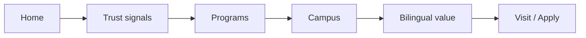

# Website redesign — strategy (Phase 2)

Premium bilingual school website for the Riyadh market: **luxury education** positioning, **high conversion**, and **maintainable** React + Laravel integration.

---

## 1. Target user journey

Primary actor: **parent** (often father) evaluating private / international boys’ education in Riyadh.

Ideal path:

1. **Land** — immediate sense of quality, location, and who the school is for (no generic fluff).
2. **Trust** — concrete signals (supervision, continuum, bilingual intent, transparency).
3. **Programs** — stage-by-stage clarity (Early Years → Primary → Middle → High) with a path to detail.
4. **Campus** — facilities + optional immersive media + invitation to visit.
5. **Differentiation** — bilingual model explained sharply (not “we teach two languages”).
6. **Action** — book visit, WhatsApp, or register; repeated calmly, not shouty.

Secondary paths: About, Student Life, News for depth; Admissions and Contact as explicit conversion hubs.

---

## 2. Sitemap (current + intent)

| Route | Purpose |
|-------|---------|
| `/` | Conversion homepage (luxury layer, ordered sections) |
| `/about` | Story, pillars (CMS + fallback) |
| `/academics` | Curriculum / pathway depth |
| `/student-life` | Culture, wellbeing, activities |
| `/facilities` | Full facilities story |
| `/admissions` | Process steps |
| `/registration` | Form + API options |
| `/news` | Highlights / CMS-ready list |
| `/contact` | Visit / contact details |
| `/admin/*` | Staff only (unchanged) |

No URL changes required for v1; internal links prioritize `/contact`, `/registration`, `/admissions`, `/academics`.

---

## 3. Homepage structure (implemented direction)

1. **Hero** — Strong headline, subhead, primary **Book a visit** (`/contact`), secondary **Apply** (`/registration`), tertiary text link to programs (`/academics`).
2. **Stats strip** — Scannable proof (continuum, location, bilingual, holistic care).
3. **Why choose us** — Single strong block (`HighlightsSection`, `id="why-koon"`); CMS-driven items with i18n fallback.
4. **Trust chips** — Short trust lines (`TrustBadgesSection`).
5. **Programs** — Stage cards, **clickable** to `/academics`; stable `id` keys for imagery/CMS.
6. **Showcase** — Parent-focused narrative (inquiry, community, STEM).
7. **Campus teaser** — Facilities preview + CTA to `/facilities`.
8. **Virtual tour** — Placeholder-friendly; primary CTA **Schedule a visit** (`/contact`).
9. **Bilingual value** — Bullet proof points (`BilingualValueSection`, i18n-only for now).
10. **Quick links** — Register / WhatsApp / Admissions journey.
11. **Faculty** — Human trust.
12. **News teaser** — Freshness.
13. **FAQ** — Objection handling.
14. **Admissions funnel** — Three steps: visit, WhatsApp, register (`AdmissionsFunnelSection`).
15. **Closing CTA band** — Final nudge to registration.

**Removed from homepage flow:** `ValuesRibbonSection` (duplicate “why”); kept in codebase for reuse.

---

## 4. CTA plan

| Location | Primary | Secondary |
|----------|---------|-----------|
| Header (desktop) | Book a visit → `/contact` | Apply → `/registration` |
| Hero | Same as above | + text link “Browse programs” → `/academics` |
| Virtual tour | Schedule visit → `/contact` | Admissions overview → `/admissions` |
| Programs grid | Whole card → `/academics` | — |
| Quick links | Per card (register / WhatsApp / admissions) | — |
| Admissions funnel | Step 1 contact, 2 WhatsApp, 3 registration | — |
| Footer | Contact + phone/email | — |

Tone: **confident, calm**, no aggressive animation on primary conversion bands.

---

## 5. Trust-building sections

- Stats strip (quantified / categorical facts).
- Trust badges (chips).
- Highlights (substantive differentiators, avoid empty superlatives).
- Faculty block (experience, partnership language).
- FAQ (tours, fees, bilingual, entry timing).
- Admissions funnel (clarity of next step).

Accreditations / awards: add chip copy and optional CMS fields when assets exist.

---

## 6. Bilingual content strategy

- **Source of truth:** i18n [`resources.ts`](../src/i18n/resources.ts) for static marketing strings; **Laravel JSON** for editable pages (`landing-page`, `about-page`, `admissions-page`, `contact-page`) when published.
- **RTL:** Existing `dir` + `lang` on `documentElement`; Arabic strings must stay parallel to English for section keys (`home.bilingual`, `home.admissionsFunnel`, `highlights.eyebrow`, etc.).
- **CMS hero/programs/highlights:** When API returns content, it overrides fallbacks; editorial should align with new CTA labels (visit-first) when updating payloads.

---

## 7. React component plan

| Concern | Approach |
|---------|----------|
| Homepage luxury theme | `.home-premium` wrapper + [`home-premium.css`](../src/styles/home-premium.css) (scoped tokens) |
| New sections | `BilingualValueSection`, `AdmissionsFunnelSection` |
| Hero links | Optional `primaryTo` / `secondaryTo` props; CMS types unchanged |
| SEO | `react-helmet-async` + route → i18n `seo.*` map in [`DocumentHead`](../src/components/DocumentHead.tsx) |
| Future DRY | Optional `SectionHeader`, `CtaPair` when second page adopts same rhythm |

---

## 8. Laravel content / data plan (no breaking changes)

- Keep **`ContentPage` payload** as flexible JSON; frontend types describe minimum shape.
- **Optional later:** Extend landing payload for bilingual block / funnel (or keep i18n until editorial workflow needs CMS).
- **Registration** APIs unchanged; options seeders / admin flows untouched for this phase.

---

## 9. SEO improvements

- Per-route `<title>` and `meta name="description"` via Helmet (Arabic + English copy in i18n).
- Preserve single **`h1`** on primary marketing views.
- Maintain meaningful **image `alt`** (already keyed in i18n).
- **Internal linking:** Programs → academics; hero → contact + registration + academics; funnel → contact / WhatsApp / registration.
- **Performance:** No new heavy libraries beyond small head manager; keep lazy images; avoid CLS on hero (existing aspect-ratio patterns).

---

## 10. Performance and motion

- Prefer **static or short** transitions on CTA bands (homepage luxury CSS disables infinite gradient on closing CTA within `.home-premium`).
- Respect **`prefers-reduced-motion`** (existing patterns on cards, drawer, etc.).
- **Images:** `loading="lazy"` off critical hero; width/height where possible.

---

## 11. Rollout order (completed / next)

1. ~~Audit~~ → [`website-redesign-audit.md`](website-redesign-audit.md)
2. ~~Strategy~~ → this file
3. ~~Homepage implementation~~ → sections, tokens, copy
4. ~~Global SEO + header CTAs~~ → Helmet + dual header buttons
5. **Next:** Inner pages luxury pass (optional), CMS payload refresh in Filament, structured data (JSON-LD), image CDN / `srcset`.

---

*End of Phase 2 strategy.*
